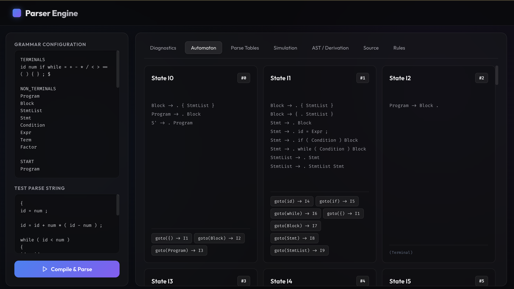
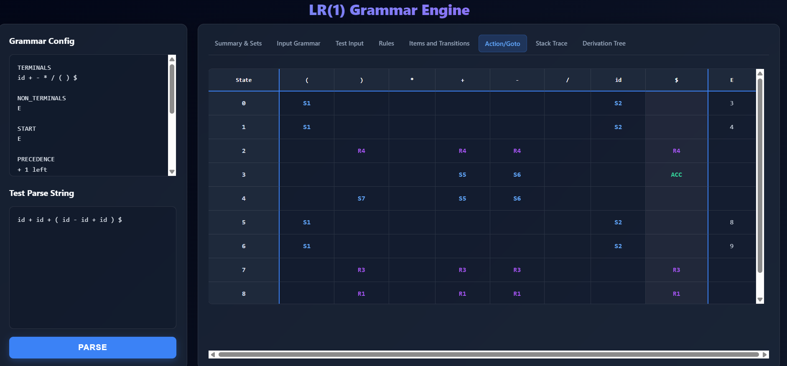
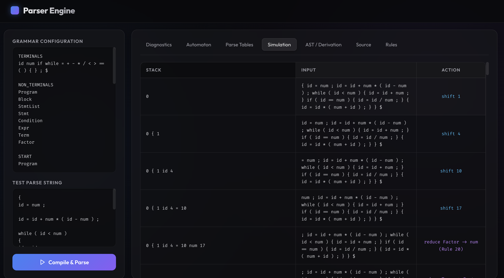

# LR-1-Parser-Engine


A lightweight LR(1) parser engine with a Flask web UI for visualizing grammar parsing, parsing tables, and parse steps.

## Features

- Flask-based interactive UI
- LR(1) parser engine built from C++ sources
- Visual graph generation for parse behavior
- Example grammars included under `data/examples/`

## Quickstart

```powershell
python -m venv .venv
.venv\Scripts\Activate.ps1
pip install -r requirements.txt
cd LR-1-Parser-Engine
.venv\Scripts\python.exe app.py
```

Open the app in your browser:

```
http://127.0.0.1:5000
```

## Example files

- `data/examples/arithmetic_grammar.txt`
- `data/examples/arithmetic_input.txt`
- `data/examples/boolean_grammar.txt`
- `data/examples/boolean_input.txt`

## Project structure

- `app.py` — Flask application entrypoint
- `src/` — C++ parser source files
- `data/` — grammar and input files
- `templates/` — HTML UI templates
- `tests/` — automated tests

## Notes

- Make sure `g++` is available in PATH so the parser can compile successfully before execution.
- The Flask app compiles the C++ parser when `/run` is called.

## Demo

Add screenshots or a short GIF to show the UI. Place images under `docs/images/` and reference them like:


Example GIFs/screenshots help visitors quickly understand the app.

## Docker / Deployment

You can run the app in Docker locally using the provided `Dockerfile` and `docker-compose.yml`:

Build and run with Docker:

```bash
docker build -t lr1-parser-engine .
docker run -p 5000:5000 lr1-parser-engine
```

Or using `docker-compose` for live code mounting:

```bash
docker-compose up --build
```

Deploy to Render (recommended quick option):

1. Sign in to Render (https://render.com) and create a new Web Service.
2. Connect your GitHub repository and select the branch.
3. Choose "Docker" as the environment (it will use the included `Dockerfile`).
4. Set the port to `5000` if prompted and deploy.

Render will build and deploy automatically on push. Alternatively, connect any container-friendly host (Railway, Fly, Heroku with container registry, etc.).

### Screenshots

Below are example screenshots from the demo. Save your images to `docs/images/` with the names shown and they will render here.







If you want, I can add these images to the repo for you — upload them here or tell me to commit and push when you're ready.

## Running tests

```powershell
cd LR-1-Parser-Engine
pytest -q
```

## License

MIT — see `LICENSE`.
